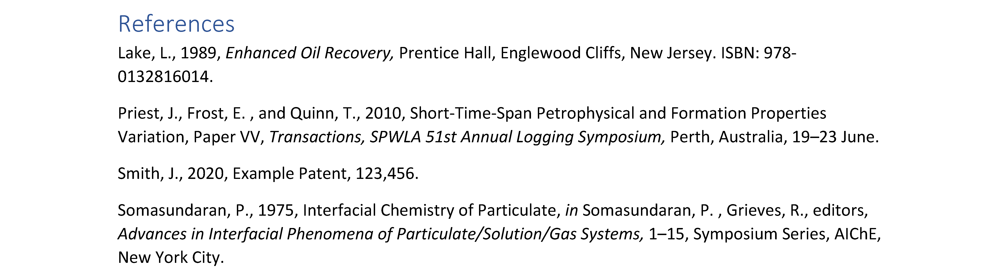

# Word biblography styles

## SPWLA

The SPWLA (2021) bilography style for MS Word. This style could be used for submitting the "*Petrophysics*" journal papers. According to the [official guide](spwla-guide), the style supports the following formats:

* Journal paper
* Conference paper
* Book / Report
* Book chapter
* Patent
* Website

We also provide a legacy version SPWLA (2019), where we support

* Journal paper
* Conference paper
* Book / Report
* Patent

The SPWLA style is modified from *Harvard - Anglia* style. If any source type is not supported, the style would fall back to *Harbard - Anglia* style.

### How to add a customized biblography style

To add the customized biblography styles, please enter the following folder:

```batch
C:\Users\<your-user-name>\AppData\Roaming\Microsoft\Bibliography\Style
```

And copy `SPWLA-2021.xsl` to that path.

### How about creating a style by yourself

Please review [the official tutorial][ms-style]. The biblography style is defined by the OpenXML format. A suggest way to write your customized style is to modify an existing official style.

## Example

Download `example.docx` to view the style.

| Example |
| ----- |
|  |

## Update report

### 2021 @ 05/31/2021

1. Upload `SPWLA 2021` style.

[spwla-guide]:https://www.spwla.org/SPWLA/Publications/Publication_Guidelines/SPWLA/Publications/Journals/Journals.aspx "Petrophysics Journal"
[ms-style]:https://docs.microsoft.com/en-us/office/vba/word/concepts/objects-properties-methods/create-custom-bibliography-styles "Create Custom Bibliography Styles"
