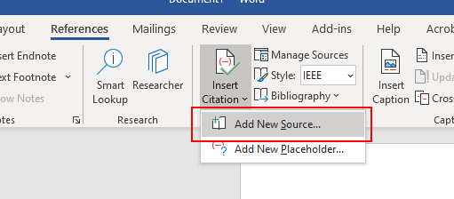
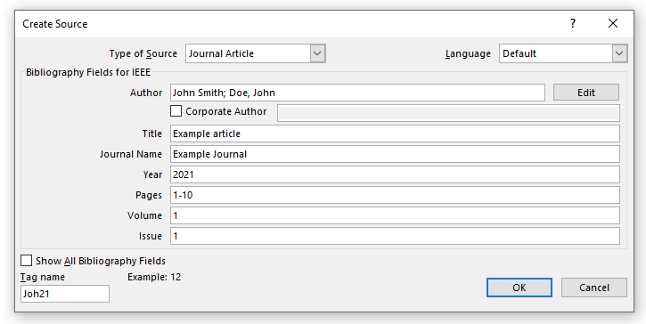
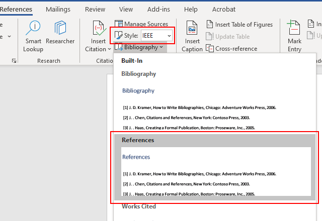

# Word biblography styles

## Introduction

This is a collection of customized Microsoft Word biblography styles. It could be used for generating the reference section with the built-in reference features.

### How to use the reference features

Here we provide a simple tutorial for using the reference features:

|  Step  |  Figure  |
| :----- | :------: |
| 1. Choose the "References" section, and add the your bilography items by using the "Add New Source". |  |
| 2. Choose a "source type", and fill the informations of the item. If you are using the default style, all types are defined. However, not all source types are supported for some customized styles. The "tag name" could be generated automatically. |  |
| 3. After adding the item, you could find that the citation tag has been added in your article. If you want to add the same citation again, you could find it in the drop list. |  |
| 4. First, choose a reference style; then choose a biblography style. The biblography section would be added instantly. |  |
| 5. If you change your citations, you could click the "update" button on your reference list. The items would be automatically re-ordered according to your current text. |  |

Please review the [example.docx](./example.docx) to view some most widely used examples of the source types.

### How to add a customized biblography style

To add the customized biblography styles, please enter the following folder:

```batch
C:\Users\<your-user-name>\AppData\Roaming\Microsoft\Bibliography\Style
```

And copy your `<style>.xsl` to that path.

### How about creating a style by yourself

Please review [the official tutorial][ms-style]. The biblography style is defined by the OpenXML format. A suggest way to write your customized style is to modify an existing official style.

## Collection list

Currently this collection includes the following styles. If any style is left blank here, it means I am arranging it. That style would be uploaded in the future:

| Title | Screenshot|
| :-----: | :-----: |
| SPWLA |  |
| ACES |  |

## Update report

### 0.1 @ 05/31/2021

1. Create this project.

[ms-style]:https://docs.microsoft.com/en-us/office/vba/word/concepts/objects-properties-methods/create-custom-bibliography-styles "Create Custom Bibliography Styles"
[ex-spwla]:../../tree/SPWLA
[ex-aces]:../../tree/ACES
