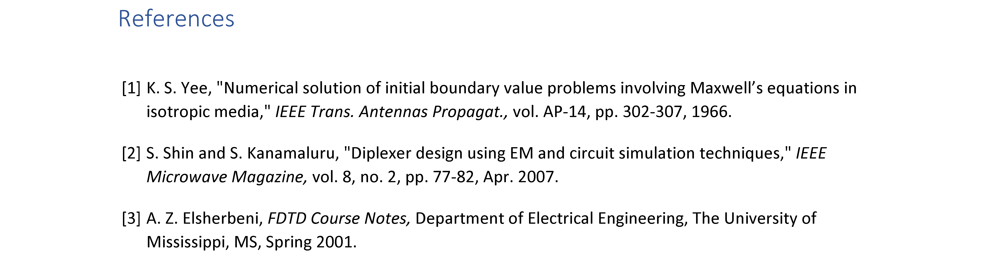

# Word biblography styles

## IEEE - ACES

> :warning: This bib style is deprecated. According to the feedback from ACES, **only IEEE conference template is acceptable now**. See the new [official guide](aces-new-guide). Use this bib style along with the old template would be rejected for modifications. We recommend using the Word built-in IEEE style instead.

The ACES (2021) bilography style for MS Word. This style could be used for submitting the "*International Review of Progress in Applied Computational Electromagnetics*" conference papers. According to the [official guide](aces-guide), the style is a little bit different from the built-in *IEEE* style. Currently, the style supports the following formats:

* Journal paper
* Conference paper
* Book
* Report
* Miscellaneous resource

The ACES style is modified from *IEEE* style. If any source type is not supported, the style would fall back to *IEEE* style.

### How to add a customized biblography style

To add the customized biblography styles, please enter the following folder:

```batch
C:\Users\<your-user-name>\AppData\Roaming\Microsoft\Bibliography\Style
```

And copy `ACES-2021.xsl` to that path.

### How about creating a style by yourself

Please review [the official tutorial][ms-style]. The biblography style is defined by the OpenXML format. A suggest way to write your customized style is to modify an existing official style.

## Example

Download `example.docx` to view the style.

| Example |
| ----- |
|  |

## Update report

### 2021 @ 06/13/2021

1. Add deprecation message.

### 2021 @ 06/01/2021

1. Upload `IEEE - ACES 2021` style.
2. Fix a bug of the report style.
3. Format the file automatically.

[aces-guide]:https://aces-society.org/journal_template.php "ACES Journal Template"
[aces-new-guide]:https://aces-society.org/conference/Online-Live_2021/conf_papers.php "2021 International Applied Computational Electromagnetics Society (ACES) Symposium"
[ms-style]:https://docs.microsoft.com/en-us/office/vba/word/concepts/objects-properties-methods/create-custom-bibliography-styles "Create Custom Bibliography Styles"
